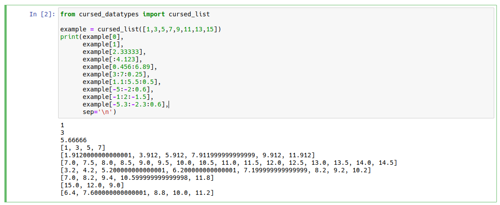

## cursed\_dataypes is a library offering cursed variations of standard Python datatypes (so far limited to cursed\_list)

---

### What is cursed about this list?

well, you know how you absolutely never thought "I wonder what element 2.345 of this list is"? 

cursed\_list allows you to find out! 

cursed\_list extends the builtin list type to allow floating point indices, or floating point slices.

It interpolates the values of the list elements to get these fractional elements; 

e.g. `cursed_list([1,2,3])[0.333])` would give `1.333`

floating point slices work similarly, including if the step is a float 

Note: this means the number of elements of a slice of a cursed\_list can be *more* than the length of the 
      original cursed\_list object. 

---

---

### Limitations:
Can only assign to cursed\_list slices as if it were a normal list; no floats

Can't handle complex number indices - I have no idea what that should even look like

### Where should I use this?
You probably shouldn't, definitely not for anything serious. 

The whole point of this is to be like nails on a chalkboard for programmers.

